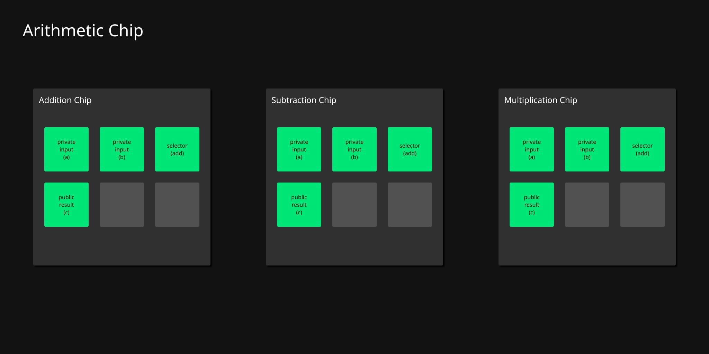
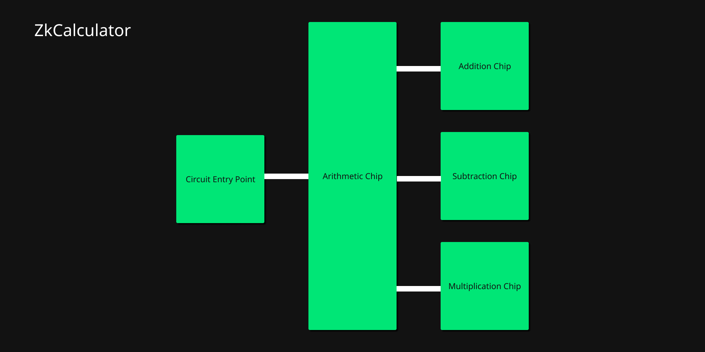

# ZK Calculator

Using halo2 crate to create basic calculator logic.

## Steps:

- receive user input
- parse user input into two operands, one operator, and one output
- compute output with caclulator circuit
- generate proof such that one (or two) operand(s) map to a given output via an
    operator
- verify proof

> NOTE: this only uses the Halo2 MockProver. It asserts circuit correctness, but
> keygen and such is synthetic.

## Chip Layout

## Circuit Architecture

